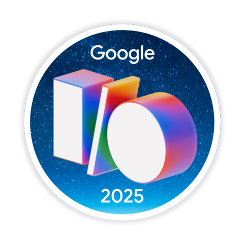
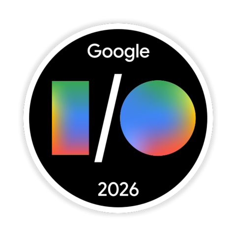

# Aravind Lal

Hi, I’m Aravind Lal, a BTech Computer Science & Engineering student at IHRD College of Engineering, Kallooppara. I specialize in cybersecurity, networking, backend systems, and working close to the hardware and OS-level. I’m passionate about building secure systems, analyzing logs, setting up servers, and exploring how networks really work and how to protect them.

## 🛠️ What I’m Working On

-  **Home Server Project**: Repurposed an old **Acer Travelmate (2015)** into a private file server using **Samba**, IP masking, and network traffic control.
-  **Sniff-Recon**: Python streamlit GUI tool for PCAP analysis, leveraging AI (GroqCloud APIs/OpenAI/Gemini) to detect anomalies, suspicious traffic patterns, and potential attacks.
-  **Multi-Boot Playground**: Parrot OS, Kali, Arch Linux, Pop!_OS - real-world OS-level experiments.

## 💡 Core Interests

- Cybersecurity • Penetration Testing • Digital Forensics  
- Networking • Firewalls • Packet Analysis  
- Backend Engineering • Log Systems • Java + MySQL  
- Hardware Builds • Home Labs • Linux Administration  
- Arch-Based Distros • Terminal Power • System Tinkering

## 🧰 Tech Stack & Tools

  

  
  
  
  
  
  
  
  
  
  
  

## 📊 GitHub Stats

 

  

  

<!-- Snake Animation (hidden)

  

-->

  

## 🏅 Google Developer Profile & Badges

  <a href="https://g.dev/mfscpayload-690"><strong>g.dev/mfscpayload-690</strong></a>

<table align="center" style="border: none; background: transparent;">
  <tr align="center" style="border: none; background: transparent;">
    <td align="center" width="20%" style="border: none; background: transparent;">
      <a href="https://developers.google.com/profile/badges/nvidia-developer">
         
        <b>Google Cloud & NVIDIA</b>
      </a>
    </td>
    <td align="center" width="20%" style="border: none; background: transparent;">
      <a href="https://developers.google.com/profile/badges/community/innovators/cloud/innovators_plus">
         
        <b>Cloud Innovators Plus</b>
      </a>
    </td>
    <td align="center" width="20%" style="border: none; background: transparent;">
      <a href="https://developers.google.com/profile/badges/community/firebasestudio/firebase-studio">
         
        <b>Firebase Studio</b>
      </a>
    </td>
    <td align="center" width="20%" style="border: none; background: transparent;">
      <a href="https://developers.google.com/profile/badges/events/io/2025/registered">
         
        <b>I/O 2025 Registered</b>
      </a>
    </td>
    <td align="center" width="20%" style="border: none; background: transparent;">
      <a href="https://developers.google.com/profile/badges/events/io/2026/registered">
         
        <b>I/O 2026 Registered</b>
      </a>
    </td>
  </tr>
  <tr align="center" style="border: none; background: transparent;">
    <td align="center" width="20%" style="border: none; background: transparent;">
      <a href="https://developers.google.com/profile/badges/activity/android/install-android-studio">
         
        <b>Android Studio User</b>
      </a>
    </td>
    <td align="center" width="20%" style="border: none; background: transparent;">
      <a href="https://developers.google.com/profile/badges/activity/idx/idx-user">
         
        <b>Project IDX User</b>
      </a>
    </td>
    <td align="center" width="20%" style="border: none; background: transparent;">
      <a href="https://developers.google.com/profile/badges/community/innovators/cloud/2021_member">
         
        <b>Cloud Innovator</b>
      </a>
    </td>
    <td align="center" width="20%" style="border: none; background: transparent;">
      <a href="https://developers.google.com/profile/badges/community/gdg/discovery">
         
        <b>GDG Discovery</b>
      </a>
    </td>
    <td align="center" width="20%" style="border: none; background: transparent;">
      <a href="https://developers.google.com/profile/badges/recognitions/actions">
         
        <b>Google Actions</b>
      </a>
    </td>
  </tr>
</table>

## 📫 Connect With Me

  
  
  
  
  

## ☕ Support My Work

  

If you find my projects helpful or interesting, consider supporting my work! ☕

